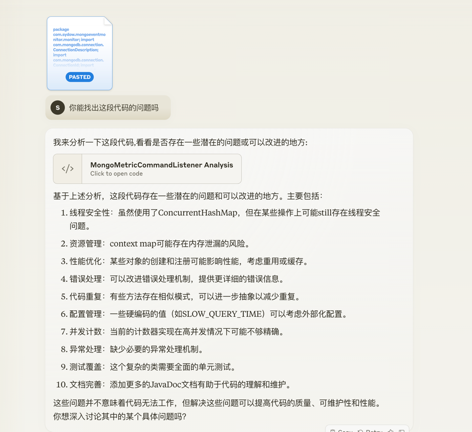

# test-memory-leak


```
我来分析一下这段代码,看看是否存在一些潜在的问题或可以改进的地方:


```java
// MongoMetricCommandListener 代码分析

// 1. 线程安全性问题
private final Map<Integer, String> context = new ConcurrentHashMap<>();
// 虽然使用了ConcurrentHashMap，但在commandStarted和commandSucceeded方法中
// 没有保证对context的读写操作是原子的，可能导致不一致

// 2. 资源泄漏风险
// context map 在commandSucceeded后没有清理，可能导致内存泄漏
public void commandSucceeded(CommandSucceededEvent event) {
    // ... existing code ...
    // 应该添加: context.remove(event.getRequestId());
}

// 3. 性能考虑
private void collectMetric(String commandName, String collection, long duration, boolean success,
                           ConnectionDescription connectionDescription, Map<String, String> msg) {
    // 每次调用都创建新的Timer，可能影响性能
    Timer slowQueryTimer = Timer.builder("mongodb.command.slowQuery.timer")
                .tag("commandName", commandName)
                .tag("collection", collection)
                .tag("mongodb.cluster_id", clusterId)
                .register(meterRegistry);
    // 考虑缓存或重用Timer实例
}

// 4. 错误处理改进
public void commandFailed(CommandFailedEvent commandFailedEvent) {
    // 只是记录了日志，可能需要更robust的错误处理机制
    log.info("mongo command failed, {}", commandFailedEvent.getThrowable().getMessage());
    // 考虑添加更详细的错误信息或错误分类
}

// 5. 代码重复
// getOrCreateTimer, getOrCreateErrorCounter 等方法有相似的模式
// 考虑抽象出一个通用方法来减少重复

// 6. 魔法数字
private static final int SLOW_QUERY_TIME = 300;
// 考虑将这类配置参数外部化，便于调整

// 7. 并发计数器的精确性
private void updateRates() {
    // 使用AtomicLong但没有保证读-修改-写操作的原子性
    // 考虑使用 LongAdder 或其他更适合高并发的计数器
}

// 8. 异常处理
// 整个类缺少try-catch块，可能需要在关键位置添加异常处理

// 9. 测试覆盖
// 这个复杂的类需要全面的单元测试来确保所有功能正确工作

// 10. 文档注释
// 类和主要方法缺少JavaDoc，添加文档有助于理解和维护

```

基于上述分析，这段代码存在一些潜在的问题和可以改进的地方。主要包括：

1. 线程安全性：虽然使用了ConcurrentHashMap，但在某些操作上可能still存在线程安全问题。

2. 资源管理：context map可能存在内存泄漏的风险。

3. 性能优化：某些对象的创建和注册可能影响性能，考虑重用或缓存。

4. 错误处理：可以改进错误处理机制，提供更详细的错误信息。

5. 代码重复：有些方法存在相似模式，可以进一步抽象以减少重复。

6. 配置管理：一些硬编码的值（如SLOW_QUERY_TIME）可以考虑外部化配置。

7. 并发计数：当前的计数器实现在高并发情况下可能不够精确。

8. 异常处理：缺少必要的异常处理机制。

9. 测试覆盖：这个复杂的类需要全面的单元测试。

10. 文档完善：添加更多的JavaDoc文档有助于代码的理解和维护。

这些问题并不意味着代码无法工作，但解决这些问题可以提高代码的质量、可维护性和性能。你想深入讨论其中的某个具体问题吗？
```


```
在这段代码中，存在几个潜在的问题和改进空间：

并发问题：使用 ConcurrentHashMap 来存储计数器和定时器，可以在高并发环境下提高性能。然而，使用 AtomicLong 来计数，存在潜在的并发修改问题，尤其是在 updateRates 方法中。应该使用 AtomicLong.accumulateAndGet 或类似方法来确保原子性。

计数器和定时器的重复注册：每次获取计数器或定时器时，都需要计算键值并检查缓存。可以使用更高效的方式来管理这些计数器和定时器。

默认仪表的初始化：DefaultMeter 的初始化可以移到构造函数外面，以提高代码可读性和维护性。

静态常量和配置：SLOW_QUERY_TIME 和 ADMIN 应该使用 final 关键字，并且可以考虑使用配置文件来管理这些静态常量。

命令上下文的存储和移除：在 commandSucceeded 和 commandFailed 方法中，应确保移除已处理完的请求 ID 以释放内存。

写错误信息的处理：在 findMsg 方法中，对于 writeErrors 的处理，应该确保 writeErrors 不为 null，并且添加更多的错误检查逻辑。
package com.sydow.mongoeventmonitor.monitor;

import com.mongodb.connection.ConnectionDescription;
import com.mongodb.connection.ConnectionId;
import com.mongodb.event.CommandFailedEvent;
import com.mongodb.event.CommandListener;
import com.mongodb.event.CommandStartedEvent;
import com.mongodb.event.CommandSucceededEvent;
import io.micrometer.core.instrument.*;
import io.micrometer.core.instrument.Timer;
import lombok.extern.slf4j.Slf4j;
import org.bson.BsonDocument;
import org.bson.BsonValue;

import java.util.*;
import java.util.concurrent.ConcurrentHashMap;
import java.util.concurrent.TimeUnit;
import java.util.concurrent.atomic.AtomicLong;

@Slf4j
public class MongoMetricCommandListener implements CommandListener {
static final Set<String> COMMANDS_WITH_COLLECTION_NAME = new LinkedHashSet<>(Arrays.asList(
"aggregate", "count", "distinct", "mapReduce", "geoSearch", "delete", "find", "findAndModify",
"insert", "update", "collMod", "compact", "convertToCapped", "create", "createIndexes", "drop",
"dropIndexes", "killCursors", "listIndexes", "reIndex"));

    private final DefaultMeter defaultMeter; // Assuming DefaultMeter is your custom class providing rates

    private static final int SLOW_QUERY_TIME = 300;
    public static final String ADMIN = "admin";
    private final MeterRegistry meterRegistry;

    private final Counter commandSuccessCounter;
    private final Counter commandErrorCounter;
    private final Map<String, Timer> timerCache = new ConcurrentHashMap<>();
    private final Map<String, Counter> errorCounterCache = new ConcurrentHashMap<>();
    private final Map<String, Counter> slowQueryCounterCache = new ConcurrentHashMap<>();
    private final Map<String, Counter> commandFailedCounterCache = new ConcurrentHashMap<>();

    private final Map<Integer, String> context = new ConcurrentHashMap<>();

    private final AtomicLong oneMinuteCounter = new AtomicLong();
    private final AtomicLong fiveMinuteCounter = new AtomicLong();
    private final AtomicLong fifteenMinuteCounter = new AtomicLong();

    public MongoMetricCommandListener(MeterRegistry meterRegistry) {
        Meter.Id meterId = new Meter.Id("mongodb.default.meter",
                                        Tags.of(List.of(Tag.of("type", "custom"))), null, null, Meter.Type.GAUGE);
        defaultMeter = new DefaultMeter(meterId, 1.0, 5.0, 15.0);
        this.meterRegistry = meterRegistry;
        this.commandSuccessCounter = meterRegistry.counter("mongodb.command.success");
        this.commandErrorCounter = meterRegistry.counter("mongodb.command.error");
        this.registerGauges();
    }

    private Timer getOrCreateTimer(String commandName, String collection, String clusterId) {
        String key = commandName + ":" + collection + ":" + clusterId;
        return timerCache.computeIfAbsent(key, k -> Timer.builder("mongodb.command.timer")
                    .tag("commandName", commandName)
                    .tag("collection", collection)
                    .tag("mongodb.cluster_id", clusterId)
                    .register(meterRegistry));
    }

    private Counter getOrCreateErrorCounter(String commandName, String collection, String clusterId, Map<String, String> msg) {
        String key = commandName + ":" + collection + ":" + clusterId + ":" + msg;
        Counter.Builder tag = Counter.builder("mongodb.command.error.count")
            .tag("commandName", commandName)
            .tag("collection", collection)
            .tag("mongodb.cluster_id", clusterId);
        for (Map.Entry<String, String> entry : msg.entrySet()) {
            tag.tag("code", entry.getValue());
            tag.tag("key", entry.getKey());
        }
        Counter register = tag.register(meterRegistry);
        return errorCounterCache.computeIfAbsent(key, k -> register);
    }

    private Counter getOrCreateSlowQueryCounter(String commandName, String collection, String clusterId) {
        String key = commandName + ":" + collection + ":" + clusterId;
        return slowQueryCounterCache.computeIfAbsent(key, k -> Counter.builder("mongodb.command.slowQuery.count")
                    .tag("commandName", commandName)
                    .tag("collection", collection)
                    .tag("mongodb.cluster_id", clusterId)
                    .register(meterRegistry));
    }

    private Counter getOrCreateCommandFailedCounter(String commandName, String collection, String clusterId, String msg) {
        String key = commandName + ":" + collection + ":" + clusterId + ":" + msg;
        return commandFailedCounterCache.computeIfAbsent(key, k -> Counter.builder("mongodb.command.failed.count")
                    .tag("commandName", commandName)
                    .tag("collection", collection)
                    .tag("mongodb.cluster_id", clusterId)
                    .tag("msg", msg)
                    .register(meterRegistry));
    }

    @Override
        public void commandStarted(CommandStartedEvent event) {
        // Implementation not required for this example
        String collection = getCollectionName(event.getCommand(), event.getCommandName());
        context.put(event.getRequestId(), collection);
    }

    @Override
        public void commandSucceeded(CommandSucceededEvent event) {
        long duration = event.getElapsedTime(TimeUnit.MILLISECONDS);

        BsonDocument bsonDocument = event.getResponse();
        BsonValue writeErrors = bsonDocument.get("writeErrors");
        boolean success = writeErrors == null;

        if (!COMMANDS_WITH_COLLECTION_NAME.contains(event.getCommandName())) {
            return;
        }

        if (ADMIN.equals(event.getDatabaseName())) {
            return;
        }

        Map<String, String> msg = findMsg(success, writeErrors);

        String collection = Optional.ofNullable(context.get(event.getRequestId())).orElse("");

        this.collectMetric(event.getCommandName(), collection, duration, success, event.getConnectionDescription(), msg);
        context.remove(event.getRequestId());
    }

    public static String getCollectionName(BsonDocument command, String commandName) {
        if (COMMANDS_WITH_COLLECTION_NAME.contains(commandName)) {
            String collectionName = getNonEmptyBsonString(command.get(commandName));
            if (collectionName != null) {
                return collectionName;
            }
        }
        // Some other commands, like getMore, have a field like {"collection": collectionName}.
        return getNonEmptyBsonString(command.get("collection"));
    }

    /**
    * @return trimmed string from {@code bsonValue} or null if the trimmed string was empty or the
    * value wasn't a string
    */
    protected static String getNonEmptyBsonString(BsonValue bsonValue) {
        if (bsonValue == null || !bsonValue.isString()) return null;
        String stringValue = bsonValue.asString().getValue().trim();
        return stringValue.isEmpty() ? null : stringValue;
    }


    private static Map<String, String> findMsg(boolean success, BsonValue writeErrors) {
        Map<String, String> msg = new HashMap<>();
        if (!success && writeErrors != null && writeErrors.isArray()) {
            for (BsonValue bsonValue : writeErrors.asArray()) {
                if (bsonValue.isDocument()) {
                    BsonDocument document = bsonValue.asDocument();
                    BsonValue errorCode = document.get("code");
                    BsonValue keyPattern = document.get("keyPattern");
                    int code = errorCode.asInt32().getValue();
                    String key = keyPattern.toString();
                    msg.put(key, String.valueOf(code));
                    break;
                }
            }
        }
        return msg;
    }

    private void collectMetric(String commandName, String collection, long duration, boolean success,
                               ConnectionDescription connectionDescription, Map<String, String> msg) {
        String clusterId = connectionDescription.getConnectionId().getServerId().getClusterId().getValue();
        Timer commandSpecificTimer = this.getOrCreateTimer(commandName, collection, clusterId);
        commandSpecificTimer.record(duration, TimeUnit.MILLISECONDS);

        if (success) {
            commandSuccessCounter.increment();
        } else {
            commandErrorCounter.increment();
        }

        if (!msg.isEmpty()) {
            Counter errorCounter = getOrCreateErrorCounter(commandName, collection, clusterId, msg);
            errorCounter.increment();
        }

        // slow

```

